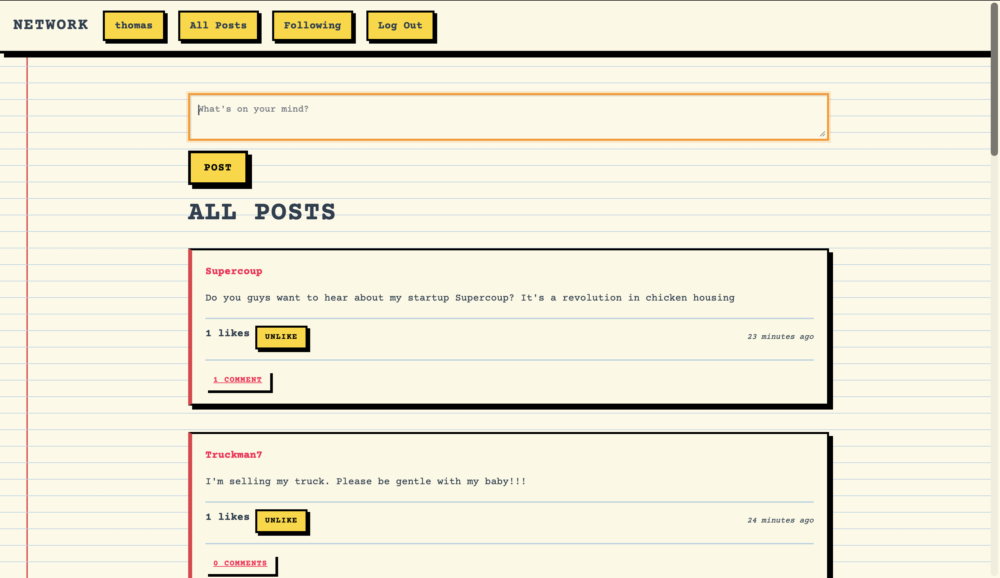

# Social Network Project



A Django-based social network application with a unique Schoolyard Yellow Notepad aesthetic.

## Styling

The project features a complete custom styling theme inspired by a schoolyard yellow notepad with neobrutalist design elements.

### Design Theme

**Last styling prompt:**
> "Lets change the styling of the project completely. We are going for a Schoolyard Yellow Notepad feel with ruled lines, Make the buttons neobrutalist with yellow, orange and red as the main colours"

### Visual Features

- **Notepad Background**: Yellow notepad background (#FEF9E7) with horizontal ruled lines and a red vertical margin line on the left
- **Neobrutalist Buttons**: 
  - Yellow (#FFD60A) for primary actions
  - Orange (#FF9500) for secondary actions and hover states
  - Red (#FF0050) for danger actions and links
  - Bold black borders (4px) with heavy drop shadows (6px offset)
  - Square corners, uppercase text, monospace font
  - Interactive press-down effect on hover/click

### Typography

- **Font**: Courier Prime (monospace typewriter font)
- **Style**: Bold, uppercase headings with increased letter spacing

### Color Palette

- Notepad Yellow: `#FEF9E7`
- Neobrutalist Yellow: `#FFD60A`
- Neobrutalist Orange: `#FF9500`
- Neobrutalist Red: `#FF0050`
- Ruled Line Blue: `#B8D4E3`
- Margin Red: `#E63946`
- Text Dark: `#2C3E50`
- Black: `#000000`

## Project Structure

```
project4/
├── network/
│   ├── static/
│   │   └── network/
│   │       └── styles.css       # Complete custom styling
│   ├── templates/
│   │   └── network/
│   │       ├── layout.html      # Base template
│   │       ├── index.html       # All posts page
│   │       ├── login.html       # Login page
│   │       ├── register.html    # Registration page
│   │       ├── profile.html     # User profile page
│   │       └── following.html   # Following feed page
│   ├── models.py
│   ├── views.py
│   └── urls.py
├── project4/
│   ├── settings.py
│   └── urls.py
└── manage.py
```

## Features

- User registration and authentication
- Create, edit, and delete posts
- Like and unlike posts
- Comment on posts
- Follow and unfollow users
- View user profiles
- View posts from users you follow
- Pagination for posts

## Setup

1. Install dependencies:
```bash
pip install -r requirements.txt
```

2. Run migrations:
```bash
python manage.py migrate
```

3. Create a superuser (optional):
```bash
python manage.py createsuperuser
```

4. Run the development server:
```bash
python manage.py runserver
```

## Technologies Used

- Django (Python web framework)
- Bootstrap 4 (base CSS framework, heavily customized)
- CSS3 (custom styling with gradients, shadows, and animations)
- JavaScript (for dynamic interactions like likes and comments)

